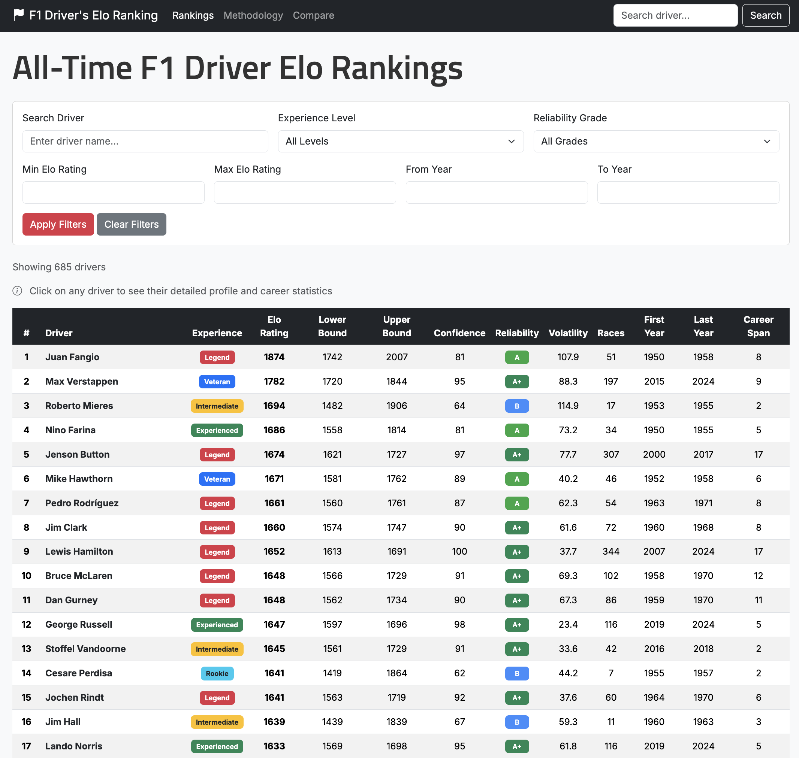
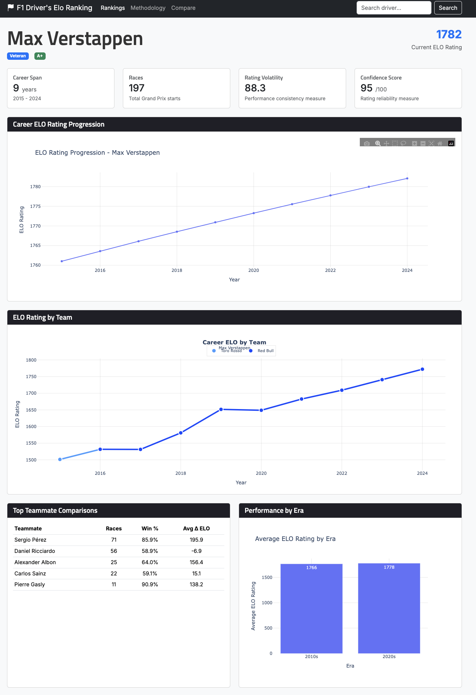
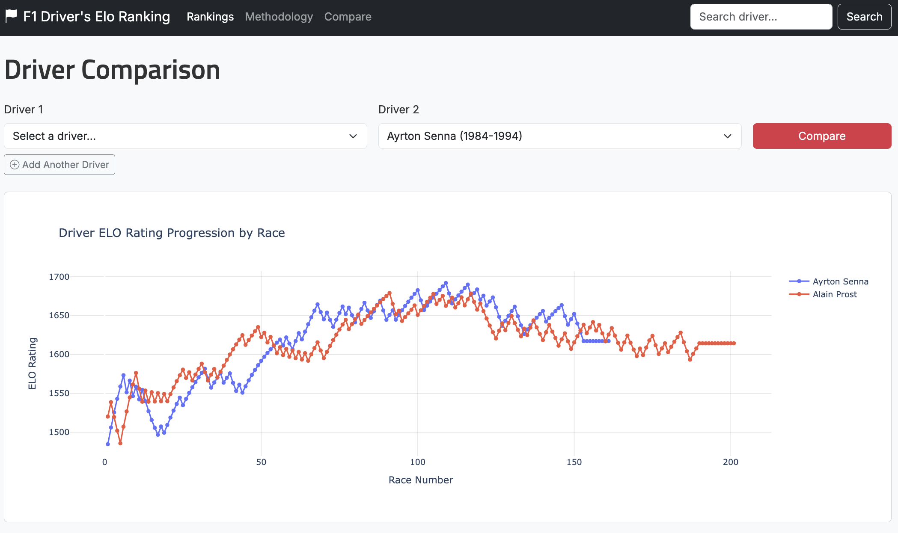

# F1 Drivers ELO Rating 🏎️

[](https://opensource.org/licenses/MIT)
[](https://www.python.org/downloads/release/python-3130/)
[](https://flask.palletsprojects.com/)
[](https://f1-elo-ranking.vercel.app/)
[](https://f1-elo-ranking.vercel.app/)

A comprehensive Formula 1 driver ranking system that uses ELO ratings to evaluate true driver ability by isolating car performance.

<p align="center">
  <a href="https://f1-elo-ranking.vercel.app/" target="_blank">
    
  </a>
</p>

### Data Coverage

| Metric | Value |
|--------|-------|
| **Time Span** | 1950 – 2024 |
| **Drivers Analyzed** | 900+ |
| **Races Processed** | 1,100+ |
| **Teammate Comparisons** | 25,000+ |

## Table of Contents
- [F1 Drivers ELO Rating 🏎️](#f1-drivers-elo-rating-️)
    - [Data Coverage](#data-coverage)
  - [Table of Contents](#table-of-contents)
  - [About](#about)
  - [Core Algorithm](#core-algorithm)
    - [Expected Score](#expected-score)
    - [Rating Update](#rating-update)
    - [Adaptive K-Factor](#adaptive-k-factor)
  - [Tech Stack](#tech-stack)
  - [Features](#features)
  - [Screenshots](#screenshots)
  - [Getting Started](#getting-started)
    - [Prerequisites](#prerequisites)
    - [Installation](#installation)
    - [Environment Setup](#environment-setup)
  - [Usage](#usage)
  - [Deployment](#deployment)
    - [Deploy Your Own](#deploy-your-own)
    - [Database Setup (Neon PostgreSQL)](#database-setup-neon-postgresql)
  - [Project Structure](#project-structure)
    - [VS Code Setup](#vs-code-setup)
    - [Troubleshooting](#troubleshooting)
  - [Development](#development)
  - [Contributing](#contributing)
    - [How to Contribute](#how-to-contribute)
  - [Roadmap](#roadmap)
  - [Known Issues](#known-issues)
  - [License](#license)
  - [Acknowledgments](#acknowledgments)

## About

Formula 1 is a sport where engineering plays a dominant role in performance. Teams with larger budgets can invest more in innovation, leading to better results. This makes it difficult to objectively determine the best driver, since car performance heavily influences race outcomes.

This project implements an ELO ranking system adapted for F1 to evaluate true driver ability. The ELO rating system, originally developed for chess, provides a mathematical method for calculating relative skill levels. In our F1 adaptation:

- Teammates drive identical cars, allowing direct performance comparisons
- Driver transitions between teams create a network of indirect comparisons
- Historical data from 1950 onwards is analyzed
- Results are adjusted for era-specific conditions and season lengths

## Core Algorithm

The ELO rating system uses the following key formulas:

### Expected Score
The probability that Driver A beats Driver B:

$$E_A = \frac{1}{1 + 10^{(R_B - R_A)/400}}$$

Where $R_A$ and $R_B$ are the current ratings. A 400-point difference corresponds to ~90% win probability.

### Rating Update
After each race, ratings are updated:

$$R_{new} = R_{old} + K \times (S - E)$$

Where:
- $K$ = K-factor (learning rate, ranges 20-40)
- $S$ = Actual score (1 for win, 0 for loss)
- $E$ = Expected score from the formula above

### Adaptive K-Factor
The K-factor adjusts based on driver experience:

| Phase | Races | K-Factor |
|-------|-------|----------|
| Rookie | 0-10 | Maximum (40) |
| Learning | 10-25 | Decays to 40% |
| Experienced | 25-50 | Stabilizes at 20% |

The final K-factor also incorporates era adjustments (0.7x for 1950s, up to 1.0x for modern era) and season length normalization.

> 📖 **Full methodology available at [f1-elo-ranking.vercel.app/methodology](https://f1-elo-ranking.vercel.app/methodology)**

## Tech Stack

| Category | Technology |
|----------|------------|
| **Backend** | Flask 3.1, Python 3.13 |
| **Database** | SQLAlchemy 2.0, PostgreSQL (Neon) |
| **Data Processing** | Pandas 2.2, NumPy 2.2 |
| **Visualization** | Plotly 5.24 |
| **Frontend** | Jinja2, Bootstrap 5 |
| **Forms** | Flask-WTF, WTForms |
| **Deployment** | Vercel (Serverless) |

## Features

- Comprehensive ELO rankings for all F1 drivers
- Detailed driver profiles with performance analytics
- Head-to-head teammate comparisons
- Era-adjusted performance analysis
- Responsive web interface
- Advanced filtering and search capabilities
- Interactive data visualizations
- Contact form for feedback and suggestions

## Screenshots

<details open>
<summary><strong>Rankings Page</strong></summary>
<br/>
<p align="center">
  
</p>
<p align="center"><em>Full driver rankings with ELO ratings, confidence scores, and filtering options</em></p>
</details>

<details open>
<summary><strong>Driver Profile</strong></summary>
<br/>
<p align="center">
  
</p>
<p align="center"><em>Detailed driver profiles with career statistics and ELO progression charts</em></p>
</details>

<details open>
<summary><strong>Head-to-Head Comparison</strong></summary>
<br/>
<p align="center">
  
</p>
<p align="center"><em>Interactive side-by-side driver comparisons with visualizations</em></p>
</details>

> 🔗 **Explore live:** [Rankings](https://f1-elo-ranking.vercel.app/rankings) · [Driver Profiles](https://f1-elo-ranking.vercel.app/driver/1) · [Head-to-Head](https://f1-elo-ranking.vercel.app/compare)

## Getting Started

### Prerequisites

- Python 3.13.0
- Git
- VS Code (recommended)
- A Gmail account (for contact form functionality)

### Installation

1. Clone the repository:
```bash
git clone https://github.com/yourusername/f1-drivers-elo-ranking.git
cd f1-drivers-elo-ranking
```

2. Create and activate a virtual environment:
```bash
# Windows
python -m venv .venv
.venv\Scripts\activate

# macOS/Linux
python -m venv .venv
source .venv/bin/activate
```

3. Install dependencies:
```bash
pip install -r requirements.txt
```

### Environment Setup

1. Create a `.env` file in the root directory:
```env
FLASK_SECRET_KEY=your_generated_secret_key
MAIL_USERNAME=your_gmail_address
MAIL_PASSWORD=your_gmail_app_password
MAIL_RECIPIENT=your_recipient_email
MAIL_SERVER=smtp.gmail.com
MAIL_PORT=587
```

To generate a secure `FLASK_SECRET_KEY`:
```python
import secrets
secure_key = secrets.token_hex(32)
print(secure_key)
```

2. Gmail Setup:
   - Enable 2-factor authentication in your Google Account
   - Generate an App Password:
     1. Go to Google Account settings
     2. Navigate to Security
     3. Under "Signing in to Google," select App Passwords
     4. Generate a new app password for "Mail"
     5. Use this password as your `MAIL_PASSWORD`

## Usage

1. Start the development server:
```bash
python run.py
```

2. Visit [http://127.0.0.1:5000](http://127.0.0.1:5000) in your browser

## Deployment

The application is deployed on **Vercel** as a serverless function.

### Deploy Your Own

1. Fork this repository
2. Connect your fork to [Vercel](https://vercel.com)
3. Configure environment variables in Vercel dashboard:
   - `FLASK_SECRET_KEY`
   - `DATABASE_URL` (PostgreSQL connection string)
   - `MAIL_USERNAME`, `MAIL_PASSWORD`, `MAIL_RECIPIENT` (optional, for contact form)
4. Deploy!

The `vercel.json` and `api/index.py` files handle the serverless configuration automatically.

### Database Setup (Neon PostgreSQL)

For production, the app uses [Neon](https://neon.tech) serverless PostgreSQL:

1. Create a Neon project at [neon.tech](https://neon.tech)
2. Copy the connection string
3. Add it as `DATABASE_URL` in Vercel environment variables
4. Run `python seed_neon.py` to populate the database

## Project Structure

```
F1-DRIVERS-ELO-RANKING/
├── app/                      # Flask application package
│   ├── __init__.py           # App factory and extensions
│   ├── models.py             # SQLAlchemy database models
│   ├── forms.py              # WTForms form definitions
│   ├── services.py           # Database initialization services
│   ├── context_processors.py # Template context processors
│   └── routes/               # Flask route blueprints
│       ├── main.py           # Home, search, methodology
│       ├── rankings.py       # Rankings page
│       ├── drivers.py        # Driver profiles, comparisons
│       └── contact.py        # Contact form
├── core/                     # Core ELO calculation logic
│   ├── driver.py             # Driver entity class
│   ├── elo_calculator.py     # ELO rating calculations
│   ├── confidence_calculator.py # Confidence intervals
│   ├── data_processor.py     # F1 data loading/processing
│   └── cache_manager.py      # Data caching utilities
├── utils/                    # Utility modules
│   ├── visualization.py      # Plotly chart generators
│   └── database.py           # Database helper functions
├── data/                     # CSV data files
├── templates/                # Jinja2 HTML templates
├── static/                   # Static assets (CSS, JS)
├── config.py                 # Flask configuration
├── run.py                    # Development entry point
├── wsgi.py                   # Production WSGI entry point
└── api/index.py              # Vercel serverless entry point
```

### VS Code Setup

1. Install recommended extensions:
   - Django (Baptiste Darthenay)
   - Python (Microsoft)
   - Pylance (Microsoft)
   - Python Debugger (Microsoft)

2. Configure Django HTML language mode:
   - Open any HTML file
   - Click on "Plain Text" in the bottom right corner
   - Select "Configure File Association for '.html'"
   - Choose "Django HTML"

3. Debug Configuration:
   1. Open the Debug view (Ctrl+Shift+D)
   2. Click "create a launch.json file"
   3. Select "Python"
   4. Choose "Flask"
   5. Update the configuration to:
```json
{
    "version": "0.2.0",
    "configurations": [
        {
            "name": "Flask",
            "type": "python",
            "request": "launch",
            "program": "run.py",
            "console": "integratedTerminal"
        }
    ]
}
```

### Troubleshooting

If you encounter "Access to 127.0.0.1 was denied" in Chrome:
1. Navigate to `chrome://net-internals/#sockets`
2. Click "Flush socket pools"
3. Refresh the development server

## Development

The project follows a specific commit message convention based on [Conventional Commits](https://www.conventionalcommits.org/):

1. Commits MUST be prefixed with a type: feat, fix, etc.
2. Use feat for new features
3. Use fix for bug fixes
4. Optional scope in parentheses
5. Description must follow the type/scope
6. Breaking changes must be indicated in footer
7. Example: `feat(database): add race count validation`

## Contributing

Contributions are welcome! We're looking for help with:
- Code improvements
- Bug fixes
- New features
- Documentation
- UI/UX enhancements

### How to Contribute

1. Fork the repository
2. Create a feature branch: `git checkout -b feature/AmazingFeature`
3. Commit your changes: `git commit -m 'feat: Add AmazingFeature'`
4. Push to the branch: `git push origin feature/AmazingFeature`
5. Open a Pull Request

## Roadmap

Planned features and improvements:

- Season-specific ELO progression viewer
- Constructor-based filtering and analysis
- Driver photos and nationality information
- Enhanced database architecture
- Improved visualization libraries
- Enhanced dashboard with more insights
- Automated data updates

## Known Issues

- Identified minor race count discrepancies for some drivers due to differences between Kaggle dataset and official F1 records:
  - Michael Schumacher (+2 races)
  - Richie Ginther (+1 race)

## License

This project is licensed under the MIT License - see the [LICENSE](LICENSE) file for details.

Data source: [Formula 1 World Championship (1950-2024)](https://www.kaggle.com/datasets/rohanrao/formula-1-world-championship-1950-2020) (CC0: Public Domain)

## Acknowledgments

- Inspired by [Mr V's Garage](https://www.youtube.com/watch?v=U16a8tdrbII) F1 ELO Engine video
- Thanks to the F1 community for continued support and feedback
- Original ELO rating system concept by [Arpad Elo](https://en.wikipedia.org/wiki/Elo_rating_system)

---

<p align="center">
  Made with ❤️ for the F1 community
</p>